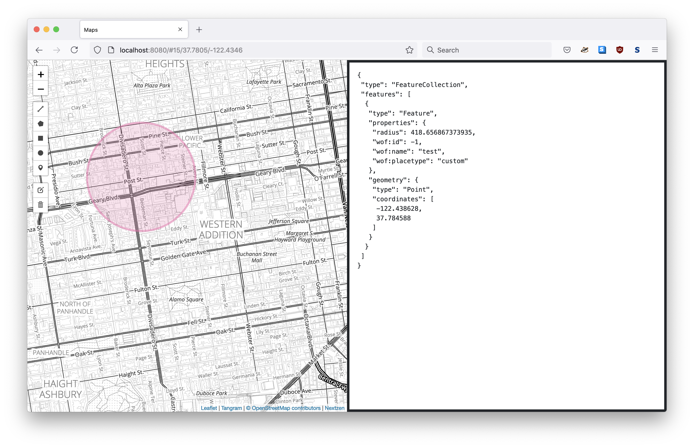

# go-http-maps

Go package providing opinionated HTTP middleware for web-based map tiles.

## Important

This is work in progress. Documentation is incomplete.

Until then have a look at [cmd/server/main.go](cmd/server/main.go) for an example of working code.

## Example



```
go run -mod vendor cmd/server/main.go \
	-map-provider tangramjs \
	-tilezen-enable-tilepack \
	-tilezen-tilepack-path /usr/local/data/sf.db
```

## See also

* https://github.com/aaronland/go-http-tangramjs
* https://github.com/aaronland/go-http-protomaps
* https://github.com/tilezen/go-tilepacks
